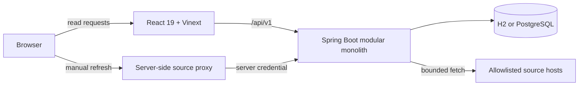

# ACE — PNA preparation workspace


ACE is a full-stack demonstrator for Portuguese doctors preparing for the **Prova Nacional de Acesso à Formação Especializada (PNA)**. It brings question discovery, reproducible mixed exams, in-session explanations, study materials, official-source feeds and readiness visualizations into one focused workspace.


> [!IMPORTANT]
> ACE is independent and is not affiliated with, approved by or certified by ACSS, GPNA, Ordem dos Médicos or Ministério da Saúde. The 200 bundled questions are synthetic demonstration content marked for clinical review. Readiness values are seeded educational visualizations, not score or placement predictions.

## What is available

| Area | Current capability |
| --- | --- |
| Question bank | 200 synthetic, review-required questions across five clinical areas, with topic, difficulty, competency and source metadata |
| Exam generation | Mixed or filtered exams with random selection and order; a stored seed in the returned manifest makes a generation reproducible |
| Practice | Answer selection, immediate explanation, provenance link, review flags and an in-session result summary |
| Materials and news | Grouped demonstration materials plus normalized news/source records |
| Readiness | Seeded time series, coverage, strengths, gaps and pacing visualizations with illustrative, explainable weights |
| Source ingestion | Manual synchronization for configured source hosts with exact resolved-URL deduplication, response limits and a per-process cooldown |
| Interface | Responsive React UI, loading skeletons, search and persistent light/dark themes |

## Product walkthrough

### Build and answer a mixed exam

Choose a template, refine the scope, generate a seeded exam, open the session and reveal the explanation for an answer.


### Explore the question pool and readiness view

| Question bank | Readiness analytics |
| --- | --- |
|  |  |

### Synchronize a configured source

Manual source refreshes run through a server-side proxy, so the ingestion credential is not exposed in the browser bundle.

> [!WARNING]
> The proxy is not end-user authentication. Anyone who can access a shared preview URL can request an allowlisted source refresh. The key authenticates only the frontend-server-to-backend hop; cooldown and fetch limits bound the prototype workflow.


For exact UI steps and operational notes, see the [usage guide](docs/USAGE.md).

## Current scope

ACE deliberately separates working infrastructure from seeded product concepts.

| Capability | Status | Notes |
| --- | --- | --- |
| Question API and database | Implemented | Flyway seeds 200 synthetic questions; they require clinical review |
| Random exam generation | Implemented | Selection and order change with the seed; generated exams are not persisted, duration is descriptive and weak-area weighting is static demo logic |
| Practice answers and flags | View-local | Answers/flags are lost when leaving the practice view; all generated-exam state resets on reload |
| Readiness dashboard | Demonstrator | The history, learner profile and recommendations are seeded |
| Source refresh | Implemented prototype | Manual only; a generic bounded parser is used and source-specific adapters are still planned |
| Authentication and multi-user data | Planned | The current learner persona is a demonstration profile |
| Clinical review workflow | Planned | Review flags exist in the content model, but no reviewer UI is available yet |

## Architecture



- The frontend keeps browser requests same-origin and proxies API traffic during local development.
- The server-side `/api/source-sync` route attaches `ACE_INGESTION_KEY`; the value never enters the client bundle, but the route does not authenticate the person using a shared preview.
- The Java backend is organized by question bank, assessment, materials, news, ingestion, analytics and dashboard modules.
- Flyway owns the schema. H2 provides zero-setup local persistence; the `postgres` profile is used by Docker Compose.

Read [the architecture notes](docs/ARCHITECTURE.md) for module boundaries, implemented safeguards and the target evolution path.

## Run locally

### Requirements

- Java 21 or newer
- Maven 3.9 or newer
- Node.js 22.13 or newer and npm

### Start the development stack

```bash
git clone https://github.com/Juskocode/ACE-.git
cd ACE-
(cd frontend && npm ci)
./scripts/dev.sh
```

Open [http://localhost:3000](http://localhost:3000). The script starts:

- the frontend on port `3000`;
- the Java backend on `127.0.0.1:8090`;
- a file-backed H2 database under `backend/data/`.

For any shared environment, provide a strong ingestion key before starting:

```bash
export ACE_INGESTION_KEY="$(openssl rand -hex 32)"
./scripts/dev.sh
```

### Start with Docker Compose

```bash
ACE_INGESTION_KEY="$(openssl rand -hex 32)" docker compose up --build
```

This starts PostgreSQL, the backend and the frontend. The backend remains bound to the host loopback interface, and all three containers use `restart: unless-stopped` so Docker can recover them after an unexpected exit.

### Share a temporary preview

With the local stack already running and `cloudflared` installed:

```bash
./scripts/tunnel.sh
```

The generated `trycloudflare.com` URL is temporary. Do not commit it to documentation or configuration.

This is a development preview, not a production deployment path. The repository does not yet provide authentication, production secret management or hardened edge access.

## Configuration

Export variables in the shell before `./scripts/dev.sh`. Docker Compose directly honors `ACE_BACKEND_PORT`, `ACE_INGESTION_KEY` and `ACE_INGESTION_SOURCE_SYNC_COOLDOWN`; its internal API and PostgreSQL values are declared in `docker-compose.yml`. When starting the frontend independently, use `frontend/.env.example` as the server-variable reference.

| Variable | Used by | Default | Purpose |
| --- | --- | --- | --- |
| `ACE_BACKEND_PORT` | dev script / Compose | `8090` | Backend host port |
| `ACE_API_URL` | frontend server / dev script | `http://127.0.0.1:8090` | Backend origin used by the server and local proxy |
| `ACE_INGESTION_KEY` | frontend server + backend | local development value | Shared server-side credential for manual refresh; set a strong value when sharing |
| `ACE_INGESTION_SOURCE_SYNC_COOLDOWN` | backend / Compose | `PT120S` | ISO-8601, per-process cooldown between refreshes of the same source |
| `ACE_DATABASE_URL` | backend | file-backed H2 URL | JDBC connection string; Compose supplies its internal PostgreSQL URL |
| `ACE_DATABASE_USER` / `ACE_DATABASE_PASSWORD` | backend | `sa` / empty for local H2 | Database credentials |
| `SITE_URL` | frontend server | `http://localhost:3000` | Canonical base used for page metadata |
| `NEXT_PUBLIC_API_URL` | browser bundle | unset | Optional public API origin; keep unset for same-origin local/tunnel operation |

See [`frontend/.env.example`](frontend/.env.example) for the frontend server variables.

## API

| Method | Route | Purpose |
| --- | --- | --- |
| `GET` | `/api/v1/dashboard` | Seeded learner dashboard |
| `GET` | `/api/v1/questions?area=&limit=` | Question pool; default limit 40, maximum 200, optional exact area filter |
| `POST` | `/api/v1/exams/generate` | Generate a randomized, seeded exam |
| `GET` | `/api/v1/materials` | Grouped study materials |
| `GET` | `/api/v1/news` | Normalized updates |
| `GET` | `/api/v1/analytics/readiness` | Readiness snapshots and analytics data |
| `GET` | `/api/v1/sources` | Configured source catalogue |
| `POST` | `/api/v1/sources/{sourceId}/sync` | Manual source refresh; requires `X-ACE-Ingestion-Key` |
| `GET` | `/actuator/health` | General application health |
| `GET` | `/actuator/health/liveness` | Liveness probe |
| `GET` | `/actuator/health/readiness` | Readiness probe |

Example:

```bash
curl 'http://127.0.0.1:8090/api/v1/questions?limit=200'

curl -X POST http://localhost:3000/api/source-sync \
  -H 'Content-Type: application/json' \
  -d '{"sourceId":"s-004"}'
```

## Verification

```bash
(cd backend && mvn test)
(cd frontend && npm run lint && npm run build)
```

The backend suite covers application startup, exam randomization, question access, source cooldowns, URL allowlisting and structured source errors. The frontend command performs static analysis and a production build.

## Repository structure

```text
ACE-/
├── backend/          Spring Boot API, domain modules and Flyway migrations
├── frontend/         React/Vinext application and server-side source proxy
├── docs/             Architecture, usage guide and repository media
├── scripts/          Local development and Cloudflare tunnel helpers
└── docker-compose.yml
```

## Data and content safeguards

- Demonstration questions are visibly labelled for clinical review. That label is metadata today, not an enforced exam-generation gate.
- Ingestion accepts only configured source hosts, validates redirects and candidate item hosts, limits response size and rejects concurrent or excessively frequent refreshes within each backend process.
- The exact resolved source URL is used for deduplication and displayed with imported records; canonical-link and tracking-parameter normalization are not implemented.
- Project policy excludes commercial PNA bibliography and identifiable clinical data unless explicit rights and governance exist; the runtime does not itself classify licences, permissions or sensitive data.
- Always confirm current PNA rules, dates and clinical guidance using the original official source.

## Contributing

Keep changes inside the existing module boundaries, add tests for behavioral changes and run both verification commands before opening a pull request. Changes to clinical content should remain marked for review until validated by an appropriately qualified reviewer.

## License

No reuse license has been selected for this repository yet. Add an explicit `LICENSE` file before inviting redistribution or external contributions.
