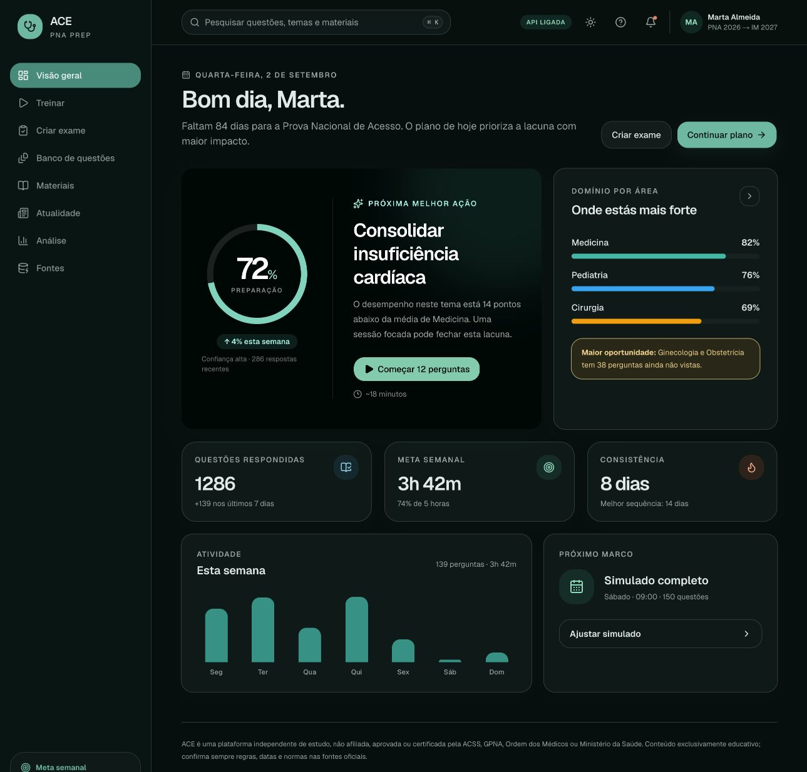
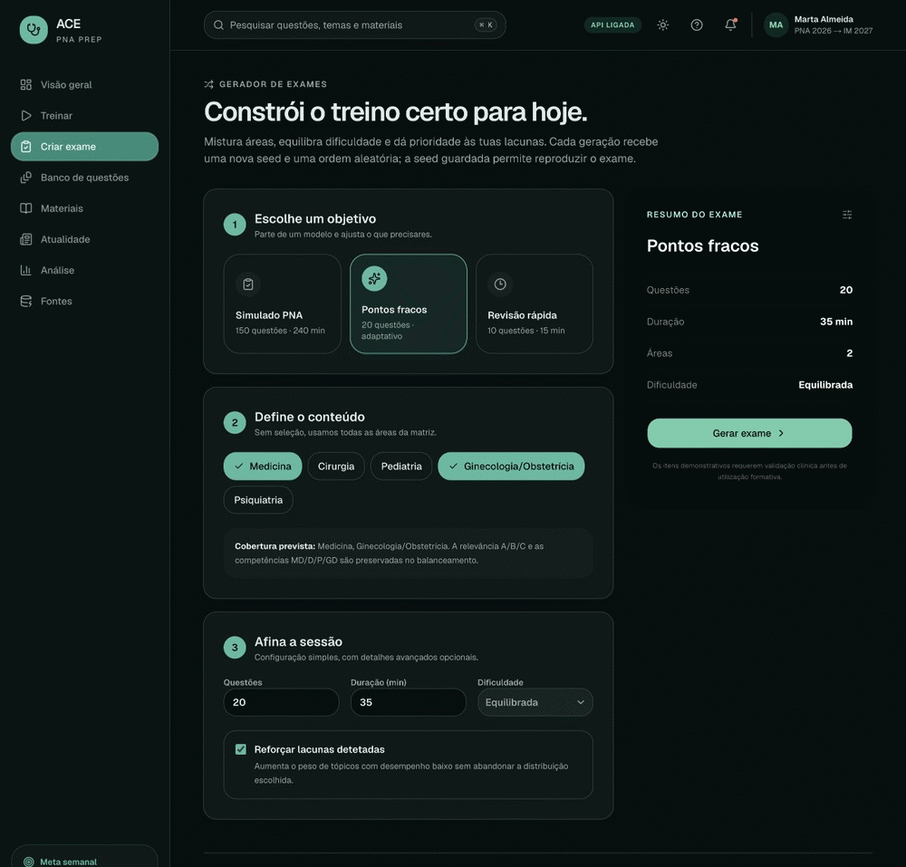
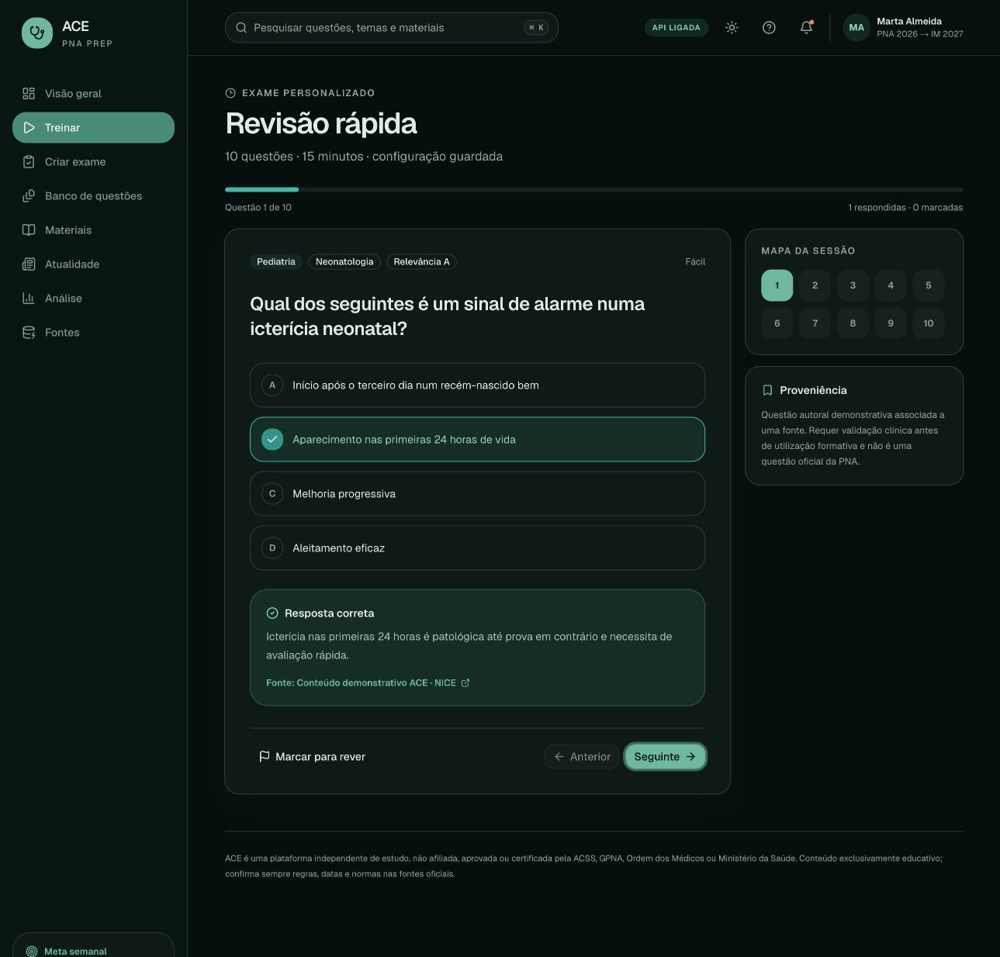
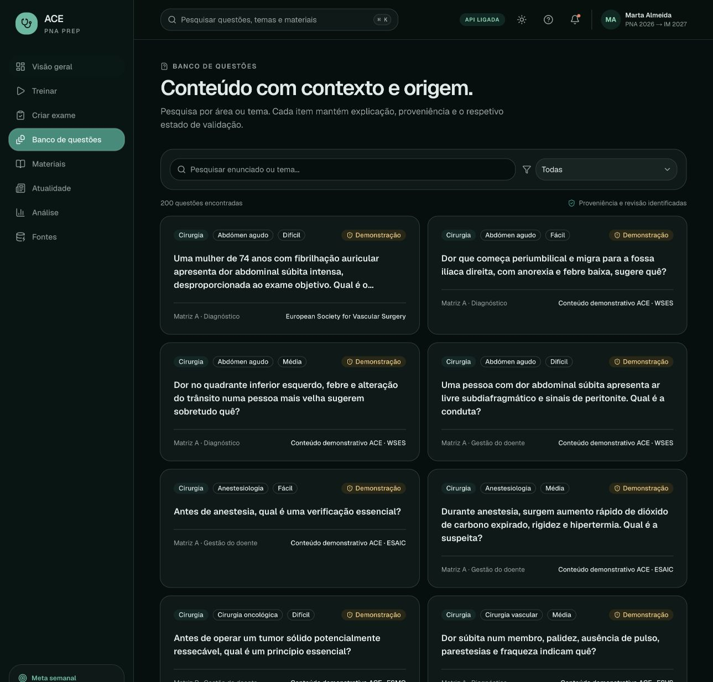
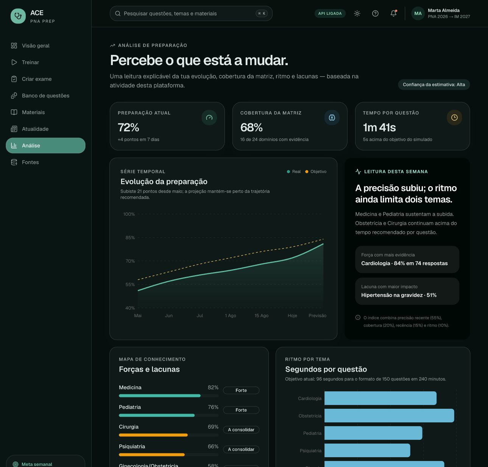
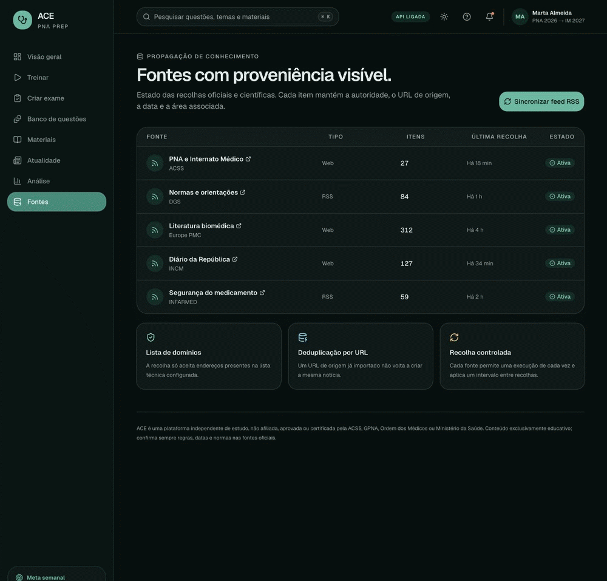
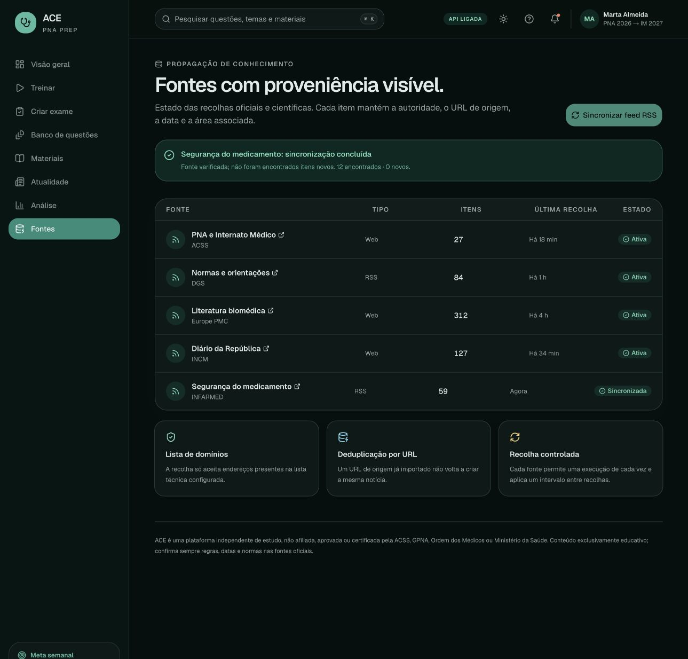

# Using ACE

This guide covers the flows currently available in the ACE demonstrator. Start the stack with `./scripts/dev.sh`, then open [http://localhost:3000](http://localhost:3000).

> The bundled learner profile, activity and readiness history are seeded. Questions are synthetic demonstration records that require clinical review and are not official PNA items.

## Dashboard and navigation

The left navigation switches between the main workspace areas without a page reload. The header shows whether data came from the Java API, provides global search and includes the light/dark theme toggle.



## Create and practise an exam



1. Select **Criar exame**.
2. Choose **Simulado PNA**, **Pontos fracos** or **Revisão rápida**.
3. Optionally select clinical areas and adjust question count, descriptive duration and difficulty.
4. Select **Gerar exame**. ACE requests a new random seed and the backend returns a shuffled exam manifest.
5. Select **Abrir exame**.
6. Choose an answer and select **Ver resposta** to reveal the explanation and source link.
7. Use **Marcar para rever**, **Anterior** and **Seguinte** while the session remains open.

The same seed reproduces selection and order against the same question dataset. The generated exam remains available while the current app mount is open. Answers and review flags belong to the current **Treinar** view and are lost when navigating away; all of this state resets after a reload.

Duration is metadata only; the current practice view has no countdown or time enforcement. **Pontos fracos** uses a fixed demonstration weighting for Ginecologia/Obstetrícia and Psiquiatria rather than evidence from the seeded learner profile.

### Answer feedback



The explanation panel identifies the correct response and links to the associated source metadata. This does not imply that the synthetic question has been clinically approved.

## Search the question pool

Open **Banco de questões** to search the stem or topic and filter by area. The default dataset contains 200 records across Medicina, Cirurgia, Pediatria, Ginecologia/Obstetrícia and Psiquiatria.



Every card exposes its area, topic, difficulty, competency/matrix label, demonstration status and source attribution.

## Read the readiness view

Open **Análise** to inspect the seeded time series, coverage, pacing, strengths and gaps.



The formula shown in the interface is explainable, but the current values are demonstration data. Practice answers do not yet persist or recalculate this view.

## Refresh a configured source



<details>
<summary>View the static success state</summary>



</details>

1. Open **Fontes**.
2. Select **Sincronizar feed RSS** for the primary RSS source, or use the status button on a specific row.
3. Wait for the success or review banner.

Manual refreshes require the frontend server and Java backend to share `ACE_INGESTION_KEY`. This protects the server-to-server request, not the end user: anyone with access to a shared preview URL can call the proxy. Within one backend process, a source can run only once at a time and has a 120-second cooldown.

Candidate URLs outside the configured host allowlist are discarded. An exact resolved URL already in `news_items` is not inserted twice; canonical-link discovery and tracking-parameter normalization are not implemented.

Configured feeds can change or become unavailable. A successful request means the source was fetched and parsed; it does not guarantee that new records were found.

## Use light or dark mode

Select the sun/moon button in the header. The preference is stored in the browser and restored on the next visit.

## Share a temporary local preview

With ACE already running and `cloudflared` installed:

```bash
./scripts/tunnel.sh
```

Share only the generated HTTPS URL. It is temporary and stops working when the local tunnel process exits. The Java backend stays on the loopback interface; the tunnel targets only the frontend.

This tunnel is for development previews only. ACE does not yet include authentication or production access controls.

## Known demonstrator limitations

- There is no authentication or multi-user persistence.
- Generated exams are not stored; practice responses and flags also disappear when leaving **Treinar**.
- Configured duration is descriptive and no exam timer is implemented.
- Weak-area prioritization is fixed demonstration logic, not learner-derived adaptation.
- Readiness and recommendations use seeded data.
- If an initial backend read fails, the interface falls back to its bundled dataset and displays **Modo demo**.
- If only exam generation fails, the generated card and manifest identify the six-question local fallback even when the header still reflects a successful initial API load.
- Material/news secondary actions are presentation-only in the current UI.
- Source ingestion currently creates normalized news records only; it does not generate questions, update materials or recalculate readiness.
- Source synchronization is manual, uses a generic parser and varies with each publisher; source-specific adapters are still planned.
- The clinical-review marker is metadata and does not currently prevent a question from appearing in a generated exam.
- All bundled questions require clinical review before any formative use.

Return to the [main README](../README.md) or read the [architecture notes](ARCHITECTURE.md).
